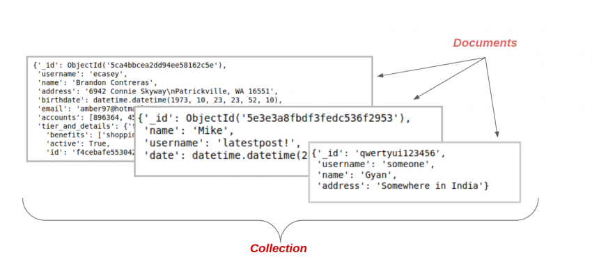

# What is MongoDB?

MongoDB is an unstructured database. It stores data in the form of documents. MongoDB is able to handle huge volumes of data very efficiently and is the most widely used NoSQL database as it offers rich query language and flexible and fast access to data.

## The Architecture of a MongoDB Database

The information in MongoDB is stored in **documents**. Here, a document is analogous to **rows** in structured databases.

- Each document is a collection of key-value pairs
- Each key-value pair is called a *field*
- Every document has an *_id*  field, which uniquely identifies the documents
- A document may also contain nested documents
- Documents may have a varying number of fields (they can be blank as well)
These documents are stored in a *collection*. A collection is literally a collection of documents in MongoDB. This is analogous to *tables* in traditional databases.

# What is PyMongo?

**PyMongo** is a Python library that enables us to connect with MongoDB. It allows us to perform basic operations on the MongoDB database.

We have chosen **Python** to interact with **MongoDB** because it is one of the most commonly used and considerably powerful languages for data science. PyMongo allows us to retrieve the data with dictionary-like syntax.

## Sources 
https://www.analyticsvidhya.com/blog/2020/02/mongodb-in-python-tutorial-for-beginners-using-pymongo/