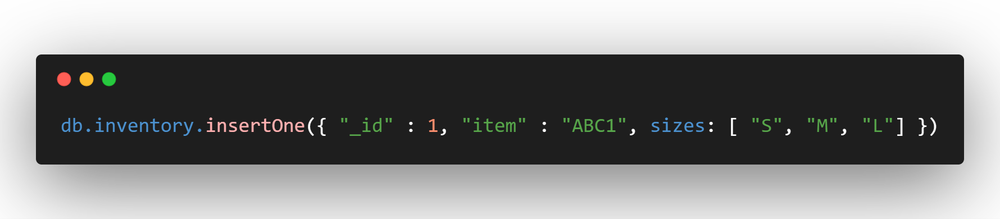

# Pymongo
This Module is intended as an introduction to working with MongoDB and PyMongo.

## Installation
PyMongo can be installed with pip:

```
$ python -m pip install pymongo
```

Or easy_install from setuptools:

```
$ python -m easy_install pymongo
```

You can also download the project source and do:

```
$ python setup.py install
```

> **Note:** Do not install the “bson” package from pypi. PyMongo comes with its own bson package; doing “easy_install bson” installs a third-party package that is incompatible with PyMongo.


## Prerequisites
Before we start, make sure that you have the PyMongo distribution installed. In the Python shell, the following should run without raising an exception:

```
>>> import pymongo
```

This tutorial also assumes that a MongoDB instance is running on the default host and port. Assuming you have [downloaded and installed MongoDB](https://github.com/Shazisaremi/Installations/blob/main/pymongo/README.md)

## Making a Connection with MongoClient
The first step when working with **PyMongo** is to create a MongoClient to the running mongod instance. Doing so is easy:

```
>>> from pymongo import MongoClient
>>> client = MongoClient()
```
The above code will connect on the default host and port. We can also specify the host and port explicitly, as follows:

```
>>> client = MongoClient('localhost', 27017)
```

Or use the MongoDB URI format:

```
>>> client = MongoClient('mongodb://localhost:27017/')
```

## Getting a Database
A single instance of MongoDB can support multiple independent databases. When working with PyMongo you access databases using attribute style access on MongoClient instances:

```
>>> db = client.test_database
```

If your database name is such that using attribute style access won’t work (like test-database), you can use dictionary style access instead:

```
>>> db = client['test-database']
```

## Getting a Collection
A collection is a group of documents stored in MongoDB, and can be thought of as roughly the equivalent of a table in a relational database. Getting a collection in PyMongo works the same as getting a database:

```
>>> collection = db.test_collection
```

or (using dictionary style access):

```
>>> collection = db['test-collection']
```

An important note about collections (and databases) in MongoDB is that they are created lazily - none of the above commands have actually performed any operations on the MongoDB server. Collections and databases are created when the first document is inserted into them.

## Documents
Data in MongoDB is represented (and stored) using JSON-style documents. In PyMongo we use dictionaries to represent documents. As an example, the following dictionary might be used to represent a blog post:

```
>>> import datetime
>>> post = {"author": "Mike",
...         "text": "My first blog post!",
...         "tags": ["mongodb", "python", "pymongo"],
...         "date": datetime.datetime.utcnow()}
```

Note that documents can contain native Python types (like `datetime.datetime` instances) which will be automatically converted to and from the appropriate BSON types.

## Inserting a Document
To insert a document into a collection we can use the `insert_one()` method:

```
>>> posts = db.posts
>>> post_id = posts.insert_one(post).inserted_id
>>> post_id
ObjectId('...')
```
 
When a document is inserted a special key, `"_id"`, is automatically added if the document doesn’t already contain an `"_id"` key. The value of `"_id"` must be unique across the collection.

`insert_one()` returns an instance of **InsertOneResult**. For more information on `"_id"`, see the documentation on `_id`.

After inserting the first document, the posts collection has actually been created on the server. We can verify this by listing all of the collections in our database:

```
>>> db.collection_names(include_system_collections=False)
[u'posts']
```

## Getting a Single Document With **find_one()**
The most basic type of query that can be performed in MongoDB is find_one(). This method returns a single document matching a query (or None if there are no matches). It is useful when you know there is only one matching document, or are only interested in the first match. Here we use find_one() to get the first document from the posts collection:

```
>>> import pprint
>>> pprint.pprint(posts.find_one())
{u'_id': ObjectId('...'),
 u'author': u'Mike',
 u'date': datetime.datetime(...),
 u'tags': [u'mongodb', u'python', u'pymongo'],
 u'text': u'My first blog post!'}
```
The result is a dictionary matching the one that we inserted previously.

> **Note:** The returned document contains an `"_id"`, which was automatically added on insert.

`find_one()` also supports querying on specific elements that the resulting document must match. To limit our results to a document with author “Mike” we do:

```
>>> pprint.pprint(posts.find_one({"author": "Mike"}))
{u'_id': ObjectId('...'),
 u'author': u'Mike',
 u'date': datetime.datetime(...),
 u'tags': [u'mongodb', u'python', u'pymongo'],
 u'text': u'My first blog post!'}
 ```
If we try with a different author, like “Eliot”, we’ll get no result:

```
>>> posts.find_one({"author": "Eliot"})
```


## Querying By ObjectId
We can also find a post by its _id, which in our example is an ObjectId:
```
>>> post_id
ObjectId(...)
>>> pprint.pprint(posts.find_one({"_id": post_id}))
{u'_id': ObjectId('...'),
 u'author': u'Mike',
 u'date': datetime.datetime(...),
 u'tags': [u'mongodb', u'python', u'pymongo'],
 u'text': u'My first blog post!'}
 ```
Note that an ObjectId is not the same as its string representation:

```
>>> post_id_as_str = str(post_id)
>>> posts.find_one({"_id": post_id_as_str}) # No result
>>>
```


## Inserting many Documents
`insert_many()` This method is used to insert multiple entries in a collection or the database in MongoDB. The parameter of this method is a list that contains dictionaries of the data that we want to insert in the collection.

This is faster and more straightforward than calling `.insert_one()` multiple times. The call to `.insert_many()` takes an iterable of documents and inserts them into the tutorial collection in your rptutorials database.

```
>>> post_2 = {"author": "Leo",
        "text": "Fasting 14-10",
        "tags": ["python", "pymongo", "django"],
        "date": datetime.datetime.utcnow()}

>>> post_3 = {"author": "Jack",
        "text": "Fastest Car",
        "tags": ["mongodb", "python", "pyspark"],
        "date": datetime.datetime.utcnow()}
        
>>> new_result = collection.insert_many([item2, item3])
```

## $unwind (aggregation)
### Definition
`$unwind`
Deconstructs an array field from the input documents to output a document for each element. Each output document is the input document with the value of the array field replaced by the element.

### Examples 
create a sample collection named **inventory** with the following document:



The following aggregation uses the `$unwind` stage to output a document for each element in the `sizes` array:

.png)

The operation returns the following results:

.png)

Each document is identical to the input document except for the value of the `sizes` field which now holds a value from the original `sizes` array.

## $group (aggregation)
### Definition

`$group` Groups input documents by the specified `_id` expression and for each distinct grouping, outputs a document. The `_id` field of each output document contains the unique group by value. The output documents can also contain computed fields that hold the values of some **accumulator expression**.

> **Note :** 
> 
> $group does not order its output documents.

The `$group` stage has the following prototype form: 

.png)


| Field       | Description|
|:------------|:-----------|
|`_id`        | Required. If you specify an `_id` value of null, or any other constant value, the `$group` stage calculates accumulated values for all the input documents as a whole.|
|`field`      | *Optional*. Computed using the accumulator operators.|

The `_id` and the **accumulator operators** can accept any valid `expression`.

.png)
.png)
Since in your example the expression is 1, it will aggregate a value of one for each document in the group, thus yielding the total number of documents per group.
.png)
## $sort (aggregation)
### Definition

`$sort` Sorts all input documents and returns them to the pipeline in sorted order.
The `$sort` stage has the following prototype form:

.png)

`$sort` takes a document that specifies the field(s) to sort by and the respective sort order. `<sort order>` can have one of the following values:

| Value       | Description|
|:------------|:-----------|
|`1`        | Sort ascending. |
|`-1`       | Sort descending.|

If sorting on multiple fields, sort order is evaluated from **left to right**. For example, in the form above, documents are first sorted by `<field1>`. Then documents with the same `<field1>` values are further sorted by `<field2>`.

### Example

The following command uses the `$sort` stage to sort on the `count` and `_id` field:
.png)


