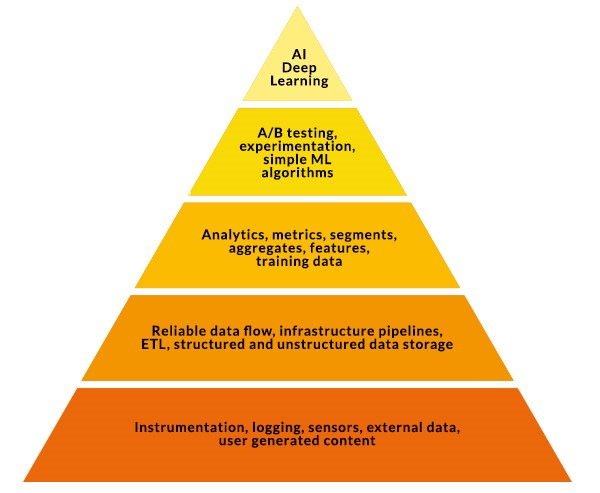
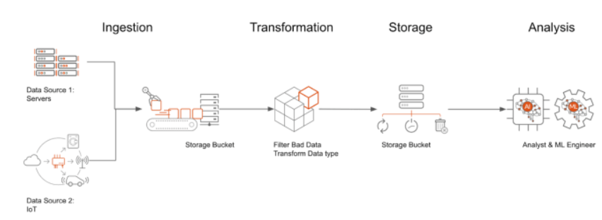

# Introduction

Once an organisation makes a strategic decision to develop data intelligent products, the essential first step is to build the infrastructure to source, collect and store the relevant data. 

According to the collection of needs for data science, artificial intelligence (AI) and machine learning (ML) algorithms sit at the top two levels of the pyramid. This pyramid highlights the relative importance of building an effective data pipeline enabling efficient data flow, integration, storage and retrieval.

Figure 1. Rogati, M. (2017). Data Science—Hierarchy of Needs. Retrieved from https://hackernoon.com/hn-images/1*7IMev5xslc9FLxr9hHhpFw.png

Data can be collected from an external source or internal source. The structure of data coming from different sources can vary significantly. An effective data pipeline needs to consider both the source and structure of the data. Additionally, the data pipeline needs to address the ‘V’ characteristics of big data.

Thus, in a big data project, the essential first step is to identify the data sources and build the infrastructure to collect, process and store the data so that the data can be efficiently retrieved by the data scientists. In this Module, you will learn about:

- Different sources of data;
- The varying structures of data;
- The ‘data lake’ concept and its importance in a data-driven organisation;
- The principles and guidelines to follow when developing a data lake; and
- The principles and techniques of data ingestion.

## Data pipeline
A Data Pipeline is a series of processes that collects raw data from various sources, filters the disqualified data, transforms them into the appropriate format, moves them to the places you want to store them, analyzes them, and finally presents them to your audience.

As we can see in the chart above, a data pipeline is analogous to a water flow: data flows from one stage to another while being processed and reshaped. And in some cases, data will be required to loop back to previous stages or be processed multiple times in the same stage.

For example, a data pipeline may ingest log data from thousands of drones running on Ubuntu Core or ROS. Those logs could be written to a petabyte-scale object store, such as Google Cloud Storage. You can then create a SQL database on your Virtual Machines – for example, to perform analysis or to serve aggregate statistics. Ubuntu Pro on Google Cloud is the ideal operating system to host a database like PostgreSQL, a free, open-source relational database management system that you can work with using the industry-standard SQL query language. By adopting Ubuntu Pro, you can ensure your PostgreSQL server gets security updates – for up to ten years!

Let’s dive deeper into these four stages of the data pipeline: Ingestion, Transformation, Storage, and Analysis.

## Ingestion
Ingestion is the process of bringing data into your working environment. Typically, there are two modes of ingestion that are prevalent – batch; and continuous/streaming. You either ingest all your data in one or several chunks, which we call batch mode, or ingest them continuously from various ingestion endpoints, for example –  the apple watches of all your family members. The latter mode we call streaming ingestion.

## Transformation
The purpose of transformation is to make your data structure align with the target schema in your later Analysis stage. Perhaps, you want to compare the performance of Tesla electric cars running in the US and China. In this case, you might want to transform all cars’ mileage into miles or kilometers. You definitely don’t want to compare miles directly with kilometers, in which case you would probably be puzzled why Tesla runs faster in China.

## Storage
After you cleaned your data, you need to store it where your analyst can easily access it. You can choose Google Cloud Storage, which is an object file system, or some serverless solutions like BigQuery, or your PostgreSQL server on Ubuntu Pro Virtual Machine.

## Analysis
Fancy Machine Learning models are not always the first choice for data analysis. A simple “SELECT” SQL query would sometimes be sufficient to gain insights. You can build your Hadoop Spark machine learning clusters on your Ubuntu machines and have the freedom to migrate between your Google Cloud environment and your on-prem data center. 

## Batch Pipeline
Batch pipelines are pipelines that process a bounded amount of data and then exit. For example, an online book store may check its inventory once every day at the end of the business. Then, this daily inventory log will be saved to the database and the pipeline will be ended. There are three types of batch pipelines: Extract and Load (EL); Extract, Load, Transform (ELT); and Extract, Transform, Load (ETL).

### Extract and Load (EL)
EL will extract the data from the source and directly load the data into the pipeline. This is especially useful when the source and destination share the same data schema. Make sure that you only use EL when the data is clean and correct, such as system logs.

### Extract, Load, Transform (ELT)
ELT allows the source data to be loaded in its original format without any modification, and then transformed whenever you need it. For example, you may hope the user will be able to view the raw data and compare it with the reconciled data when necessary. Suppose you want to distill characters from hundreds of pages of documents by using OCR pattern recognition techniques. Even though you only care about the words in those documents, it is a good idea to keep the original image of these documents. Some unrecognizable words under current technologies may be recognizable in the future by more advanced technologies.

### Extract, Transform, Load (ETL)
ETL is extremely useful when you want to implement heavy transaction machinery to the raw data. Data has been transformed before it is loaded to the target database. ETL often extracts data from multiple sources, and the processes need to be coordinated. You need to make sure the extracted data cover the same time period or apply to the same sample of the large pool.

## Streaming Pipelines
Streaming pipelines deal with continuous sources of data, such as:

IoT devices reading meters from self-driving vehicles.
Security cameras report the number of people going through the gate.
A software agent collects CPU usage data and sends it back to the monitoring server.
The most famous streaming platform may be Apache Kafka. Kafka is able to handle trillions of events a day. Events are instances that happened at a certain time. A series of events make up a Topic. You can subscribe to a Topic to get messages when an event of that topic occurs.

## Sources
https://canonical.com/blog/data-pipelines-overview