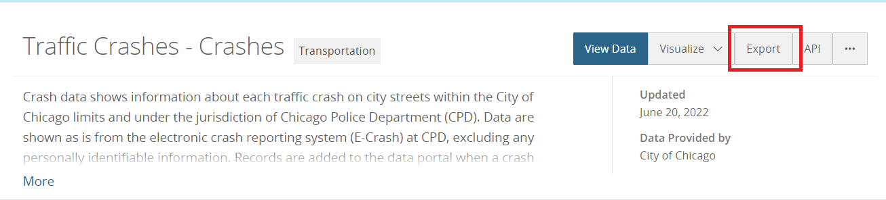

# Step 1:
Open to the following link:

http://dev.cityofchicago.org/open%20data/data%20portal/2020/07/21/traffic-crash-data-source.html

# Step 2:
For each dataset Click on the link in the red box (You have to download all three datasets in the image)

# Step 3:
Click on "Export" button

# Step 4:
Click on "CSV" button on opened window

# Step 5: 
Create a folder named "data" and store the csv file on that.  