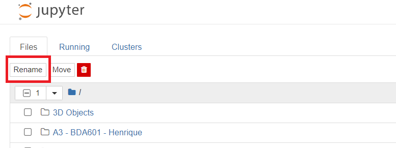
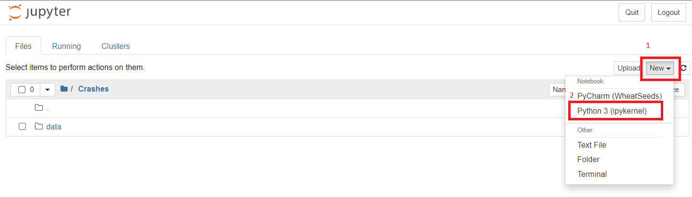

## Step 1:
open your **Jupyter lab** from **Anaconda Navigator** or **Start menu**: 
<p align="center">


</p>


## Step 2:
After the Jupyter opened, click on new on right side of page, then click on "Folder"
<p align="center">

</p>

Then the jupyter create a folder named "Untitled Folder" in the current directory. 
to change the folder name select the check box and click on "Rename" button on the left top.

<p align="center">

</p>

Change it to "Crashes" like the image below:

<p align="center">

</p>

## Step 3: 
Now go to the "Crashes" Folder created in Step 2, then create another folder named "data" in the current folder: 

<p align="center">

</p>

## Step 4: 
Click on Upload and select the downloaded data, then click on upload to start upload data to the "data" directory:

<p align="center">

</p>

## Step 5: 
Go back to "Crashes" Folder then create a new ipykernel file:

<p align="center">

</p>

rename the file to "main" by click on the "Untitled" above the page.

## Step 6
Finally you'll have the file structure like this : 
```
Crashes
│   main.ipynb 
│
└───data
    │   Traffic_Crashes_-_Crashes.csv
    │   Traffic_Crashes_-_People.csv
    │   Traffic_Crashes_-_Vehicles.csv
```