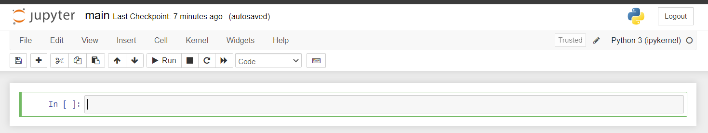

## Step 1:
At the "Crashes" Folder created in chapter 2, open the "main.ipynb" file you already created:

<p align="center">

</p>

## Step 2:
write the following code in the code bar at the first cell, Then press `Shift + Enter` to run the cell and execute commands. 
```jupyter
  !pip install pyspark
```