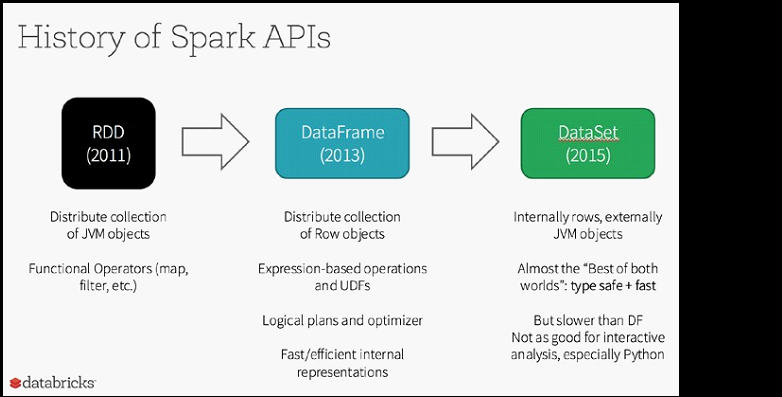

# What is Apache Spark?

Apache Spark is an open-source powerful distributed querying and processing engine. It provides flexibility and extensibility of MapReduce but at significantly higher speeds: Up to 100 times faster than Apache Hadoop when data is stored in memory and up to 10 times when accessing disk.

**Apache Spark** allows the user to read, transform, and aggregate data, as well as train and deploy sophisticated statistical models with ease. The Spark APIs are accessible in Java, Scala, Python, R and SQL. Apache Spark can be used to build applications or package them up as libraries to be deployed on a cluster or perform quick analytics interactively through notebooks (like, for instance, Jupyter, Spark-Notebook, Databricks notebooks, and Apache Zeppelin).

## Resilient Distributed Dataset

Apache Spark is built around a distributed collection of immutable Java Virtual Machine (JVM) objects called Resilient Distributed Datasets (RDDs for short). As we are working with Python, it is important to note that the Python data is stored within these JVM objects. More of this will be discussed in the subsequent chapters on RDDs and DataFrames. These objects allow any job to perform calculations very quickly.

**RDDs** have two sets of parallel operations: transformations (which return pointers to new RDDs) and actions (which return values to the driver after running a computation);

**RDD** transformation operations are _lazy_ in a sense that they do not compute their results immediately. The transformations are only computed when an action is executed and the results need to be returned to the driver.

At the same time, RDDs expose some coarse-grained transformations (such as map(...), reduce(...), and filter(...) which we will cover in greater detail in Chapter 2, Resilient Distributed Datasets)
## DataFrames

DataFrames, like RDDs, are immutable collections of data distributed among the nodes in a cluster. However, unlike RDDs, in DataFrames data is organized into named columns.

> Note: 
> 
> If you are familiar with Python's pandas or R data.frames, this is a similar concept

DataFrames were designed to make large data sets processing even easier. They allow developers to formalize the structure of the data, allowing higher-level abstraction; in that sense DataFrames resemble tables from the relational database world. DataFrames provide a domain specific language API to manipulate the distributed data and make Spark accessible to a wider audience, beyond specialized data engineers.

One of the major benefits of DataFrames is that the Spark engine initially builds a logical execution plan and executes generated code based on a physical plan determined by a cost optimizer. 

Unlike RDDs that can be significantly slower on Python compared with Java or Scala, the introduction of DataFrames has brought performance parity across all the languages.

## Datasets
 
Introduced in Spark 1.6, the goal of Spark Datasets is to provide an API that allows users to easily express transformations on domain objects, while also providing the performance and benefits of the robust Spark SQL execution engine.

