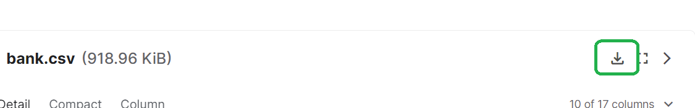

## Data Exploration and Cleaning

### Introduction:
Once the data are available, it is tempting to start building machine learning (ML) models to extract insights from the data. However, real-world data are usually noisy and dirty. For example, a data set may contain duplicate values, missing observations and outliers. Thus, one of the first stages in a data science project is to clean the data (e.g., to detect and correct any inaccurate records in the data). Even if the data are clean, it is essential to explore the data statistically and visually to understand the data’s underlying structures and patterns.

In this Module, you will learn about the attributes of data and how to explore data both statistically and visually to detect patterns and anomalies. You will also learn about how to transform a data set to reduce its volume and complexity to enable the efficient construction and interpretation of ML models.

### Download Dataset

go to kaggle: 
https://www.kaggle.com/datasets/janiobachmann/bank-marketing-dataset?resource=download

