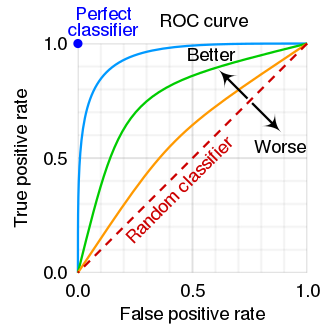
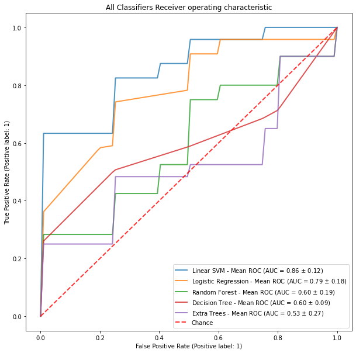
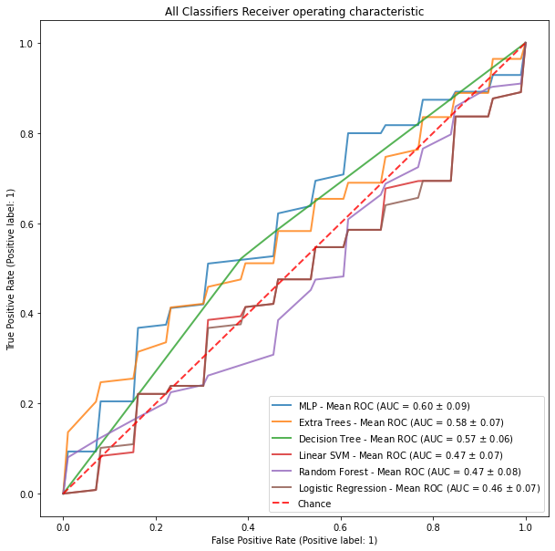
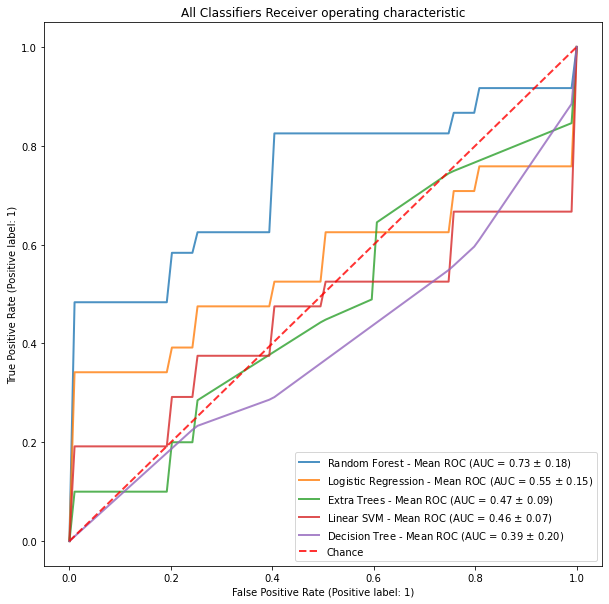

# Module 7

### Introduction
In this activity, you will compare two models as part of a model evaluation using a dataset.

### Download Dataset

Using the `audlt_ch6_training` and `adult_ch6_test` datasets, which are available at:

http://bcs.wiley.com/he-bcs/Books?action=resource&bcsId=11712&itemId=1119526817&resourceId=46601

* Open Jupyter 
* Create a folder named `Module_7`
* Put the following data `adult_ch6_training` and `adult_ch6_test` from zip file, to the folder named `DSPR_Data_Sets`

Finally, you'll have the following file structure : 
```
Module_7
│   main.ipynb 
│
└───DSPR_Data_Sets
    │   adult_ch6_training
    │   adult_ch6_test
```

### perform the following tasks using PySpark:

- Use the training dataset to create a decision tree model (Model 1) to predict a customer’s Income using Marital Status and Capital Gains and Losses; 
- Use the test data set to evaluate Model 1. Construct a contingency table to compare the actual and predicted values for Income; 
- Use the training dataset to create a decision tree model (Model 2) to predict a customer’s Income using Marital Status and Age; 
- Use the test data set to evaluate Model 2. Construct a contingency table to compare the actual and predicted values for Income; 
- Compare Model 1 and Model 2 in terms of accuracy, precision, recall and the F1 scores. After you have compared the models, present all of your key observations in the ‘Model Evaluation’ discussion forum in your own words; and 
- Read other students’ submissions and provide feedback.

### ROC 

A receiver operating characteristic curve, or ROC curve, is a graphical plot that illustrates the diagnostic ability of a binary classifier system as its discrimination threshold is varied. The method was originally developed for operators of military radar receivers starting in 1941, which led to its name. [wikipedia](https://en.wikipedia.org/wiki/Receiver_operating_characteristic)

<p align="center">

</p>

The ROC curve is created by plotting the true positive rate (TPR) against the false positive rate (FPR) at various threshold settings. The true-positive rate is also known as sensitivity, recall or probability of detection.[9] The false-positive rate is also known as probability of false alarm[9] and can be calculated as (1 − specificity). It can also be thought of as a plot of the power as a function of the Type I Error of the decision rule (when the performance is calculated from just a sample of the population, it can be thought of as estimators of these quantities).

<p align="center">

</p>

<p align="center">

</p>

<p align="center">

</p>