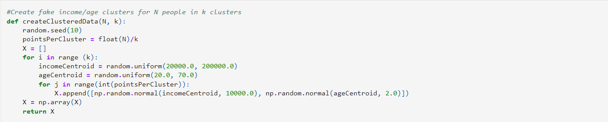
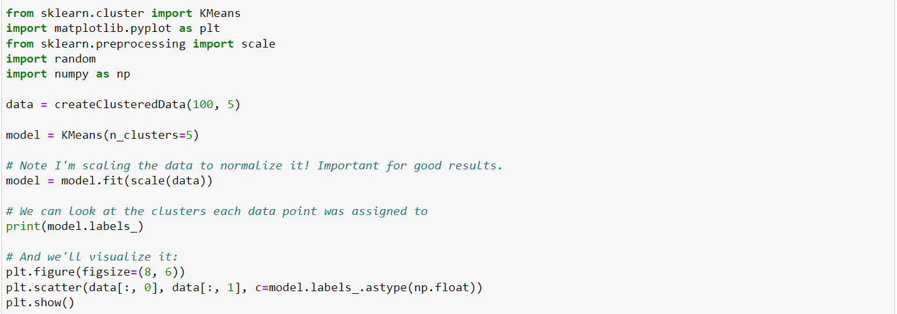

Let's see Just how easy it is to do k-means clustering, using scikit-learn and python. So the first thing I'm going to do is create some random data that I want to try to Cluster and just to make it easier. I'm going to actually build some clusters into my fake test data. So let's pretend There's some real fundamental relationship between these data. And there are some real natural clusters that exist in it. 

So to do that, I just wrote this little create clustered data function in Python, and it starts off with a consistent random seed, so you'll get the same result every time. And it takes in, I want to create clusters of n people in K clusters. So it figures out how many points per cluster that works out to first and then builds up this list X that starts off empty. So for each cluster for I in range K, I'm going to create some random centroid of income between 20,000 and 200,000 dollars and some random centroid of a tree between the age of 20 and 70. So what I'm doing here is creating some fake as fake scatter plot, that will show income versus age for n people in K clusters. So for each random centroid that I created, I'm then going to create a normally distributed set of random data, with a standard deviation of 10 thousand in income and a standard deviation of 2 in age. And that will give me back a bunch of age income data that is clustered into some pre pre existing clusters that I chose at random. Okay, let's go ahead and run that. 

 
And now to actually do k-means you'll see how easy it is. All you need to do is import k-means from scikit-learn cluster package, and we're also going to import matplotlib, so we can visualize things and also the scale things. So we can take a look at how that works in a minute.
So I'm going to use my create clustered data function to say. I want 100 random people around five clusters. So there are five natural clusters from the data that Creating. I am then going to create a model. A KMeans model with key of 5. So I am picking five clusters because I know that's the right answer. But again, an unsupervised learning you don't necessarily know what the real value of K is. You need to iterate and converge on it yourself, and then I can just call model.fit using like a means model. Using the data that I had now scale, I alluded to earlier, that's normalizing, the data. And one important thing with k-means is that it works, best. If your data is all normalized. I means everything is at the same scale. So a problem that I have here is at my age is range from 20 to 70 by incomes range all the way up to 200,000. So, these values are not really comparable. The incomes are much larger than the age values.
scale will take all that data and scale it together to a consistent scale. So I can actually compare these things as Apples to Apples, and that will help a lot with your K means results. So once I've actually called fit on my model, I have a model and I can actually look at the resulting labels that I got and then we can actually visualize it using this little bit of matplotlib. Magic. You can see here. I have a little trick here where I assign the color to the labels that I ended up with converted to some floating Point number. And that's just a little trick. You can use to assign arbitrary colors to a given value. So, let's see if we end up with. 
Didn't take that long. You can see the results here are basically what clusters, I signed everything into. And you can see we know that our fake data is already pre clustered. So it seems that it had identified, the first and second clusters. Pretty Easily 
got a little bit confused beyond that point though because our clusters here in the middle or actually a little bit mush together. They're not very really that distinct. So that was a challenge for K means but regardless it did come up with some reasonable guesses at the Clusters, you know, this is probably an example of where you four clusters were more Naturally Fit the data. So, what I want to do, For an activities to try that out. Try a different value of K and C you to no end up with you know, just eyeballing this it looks like four would work. Well, does it really what happens if I increase k 2 large, what happens to my results there? What does it try to split things into and doesn't even make sense? So play around with it. Try different values of K. So the N clusters function here change to find, something else.run it all through it again and see you teamed up with so play around it. Have some fun with it. 
Conclusion
That's all there is to k-means clustering. It's just that simple. You can just use scikit-learn’s k-means thing from cluster. And again, the only real gotcha, make sure you scale the data and normalize it. You want to make sure the things that you're using k-means on are comparable to each other, and the scale function will do that for you. So, those are the main things for k-means clustering, pretty simple concept even simpler to Do it using scikit-learn. There you have it. That's all there is to it. That's k-means clustering. So if you have a bunch of data that is unclassified, and you don't really have the right answers ahead of time. It's a good way to try to naturally find interesting groupings of your data and maybe that can give you some insight into what that data is. So good tool to have. I've used it before in the real world and it's really not that hard to use. So keep that in your tool just.
